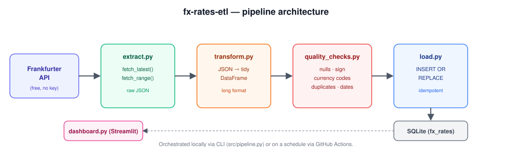

# fx-rates-etl


**🔗 Live demo:** [fx-rates-etl.streamlit.app](https://fx-rates-etl.streamlit.app/)

A small, complete **ETL pipeline** that pulls daily foreign-exchange rates from a
public API, validates and loads them into a SQLite warehouse, and visualizes
trends in a Streamlit dashboard — built to demonstrate core data engineering
fundamentals in a project small enough to read end-to-end in one sitting.



## Why this project

Most portfolio pipelines stop at "call an API and print the result." This one
tries to look like a (very small) production pipeline instead:

- **Idempotent loads** — re-running the pipeline for the same dates never creates duplicates (`INSERT OR REPLACE` keyed on `date, base, currency`)
- **Data quality gate** — data is validated *before* it's loaded, and a bad batch fails loudly instead of silently corrupting the warehouse
- **Separation of concerns** — extract / transform / validate / load each live in their own module and are independently testable
- **Tested** — unit tests mock the network, so `pytest` runs instantly and deterministically
- **Automated** — GitHub Actions runs the test suite on every push, and can run the pipeline itself on a schedule
- **Backfillable** — supports both a `latest` daily run and a `backfill` mode for historical date ranges

## Quickstart

```bash
git clone https://github.com/godwire/fx-rates-etl.git
cd fx-rates-etl

python -m venv .venv
source .venv/bin/activate      # Windows: .venv\Scripts\activate

pip install -r requirements.txt
```

Load the latest exchange rates (EUR → USD, GBP, JPY, CHF, CZK by default):

```bash
python -m src.pipeline latest
```

Or backfill a date range:

```bash
python -m src.pipeline backfill --start 2024-01-01 --end 2024-01-31 --base EUR --symbols USD,GBP,JPY
```

View the results in the dashboard:

```bash
streamlit run dashboard.py
```

Run the tests:

```bash
pytest -v
```

## Deploying the dashboard (live demo link)

The dashboard bootstraps its own data on first load, so it deploys with
**zero configuration** — no need to commit a database file.

1. Push the repo to GitHub.
2. Go to [share.streamlit.io](https://share.streamlit.io) and sign in with GitHub.
3. Click **New app**, pick this repo/branch, and set the main file to `dashboard.py`.
4. Deploy. First load takes a few seconds while it backfills the last 30 days.

Add the resulting URL to the top of this README (and to your GitHub repo's
"About" section) so anyone looking at the project can click straight through
to a working, live interface instead of just reading code.

## Project structure

```
fx-rates-etl/
├── src/
│   ├── extract.py          # talks to the Frankfurter API
│   ├── transform.py        # raw JSON -> tidy DataFrame
│   ├── quality_checks.py   # validation gate before load
│   ├── load.py              # idempotent upsert into SQLite
│   ├── db.py                 # connection + schema
│   └── pipeline.py          # orchestration + CLI
├── tests/                   # pytest, network fully mocked
├── dashboard.py             # Streamlit viewer
├── .github/workflows/ci.yml # tests on push, optional scheduled run
├── data/                     # fx_rates.db lives here (gitignored)
└── assets/                   # README diagram
```

## Data source

Rates come from the [Frankfurter API](https://www.frankfurter.app), a free,
keyless API backed by European Central Bank reference rates. No API key or
signup is required, which keeps the project runnable by anyone who clones it.

## Design notes

- **Why SQLite?** Zero setup, and the `fx_rates` table would map onto Postgres
  or a warehouse table without changes — this is meant to be a starting point,
  not a ceiling.
- **Why upsert instead of append-only?** Exchange rate providers occasionally
  revise a day's figures after publishing; upserting means a re-run always
  reflects the latest known-good value for that date.
- **Why validate before load, not after?** Catching bad data at the gate
  keeps the warehouse itself trustworthy — nothing downstream (the dashboard,
  future consumers) has to defend against malformed rows.

## Possible extensions

- Swap SQLite for Postgres and add a `docker-compose.yml`
- Add a `dbt` layer on top for further transformations
- Replace the GitHub Actions cron with a proper Airflow/Prefect DAG
- Add more source currencies or a second data source (e.g. crypto rates) to
  practice merging multiple pipelines into one warehouse

## License

MIT — see [LICENSE](LICENSE).
